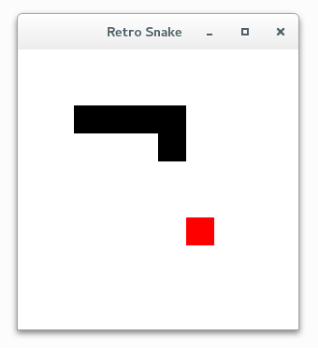

# AlphaSnake
> Retro Snake Game with Artificial Intelligence



## Features
+ Reinforcement Learning
+ Monte Carlo Tree Search

## Dependencies
+ Python 3+
+ Keras, Tensorflow
+ PyQt5

## How to use
+ Play Retro Snake by yourself (Linux)  
    ```cd alphasnake```  
    ```python alphasnake.py --play```

+ Get help and information (Linux)  
    ```cd alphasnake```  
    ```python alphasnake.py --help```  
    ```python alphasnake.py --info```

+ Train AI model (Coming)
+ Play Snake game by AI (Coming)

## Information
You can get the similar theoretical details in the paper of DeepMind company about AlphaZero [1,2].

## References
[1]Silver, David, et al. "Mastering the game of Go without human knowledge." Nature 550.7676 (2017): 354.  
[2]Silver, David, et al. "Mastering the game of Go with deep neural networks and tree search." nature 529.7587 (2016): 484.  